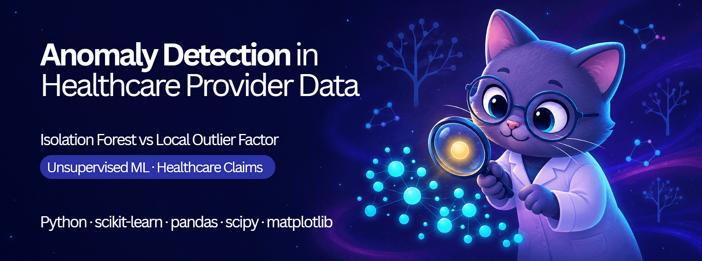

---


---

## Overview

Healthcare billing systems generate massive volumes of transactional data, and embedded within that data are anomalies — billing errors, fraudulent claims, and administrative irregularities — that drain fiscal resources and undermine institutional accountability. Detecting these without labelled fraud cases is a fundamental challenge: no supervisor can tell the model what fraud looks like because confirmed fraud labels are rarely available at scale.

This project applies and rigorously compares two foundational unsupervised anomaly detection algorithms — **Isolation Forest (IF)** and **Local Outlier Factor (LOF)** — to a real-world Medicare healthcare provider claims dataset of 100,000 records. Rather than simply reporting which algorithm "wins," the study reframes the comparison: it asks *what each algorithm is structurally capable of detecting*, whether they agree for the right reasons, and whether their disagreement is meaningful or arbitrary.

---

## 💡 Technical & Methodological Highlights

While many anomaly detection projects rely on pre-labeled data or simple metric reporting, this repository demonstrates advanced, industry-relevant methodologies:

* **Validation Without Ground Truth:** Designed a custom synthetic anomaly injection framework to rigorously evaluate model recovery capabilities when true fraud labels are unavailable.
* **Statistical Rigor at Scale:** Moved beyond basic *p*-values by implementing a hypergeometric null-model and computing practical effect sizes (Rank-Biserial *r*, Cramér's *V*) to evaluate a massive 100,000-record dataset.
* **Model Robustness & Stability:** Conducted a 95-configuration hyperparameter stability sweep to prove that findings reflect structural properties of the data, rather than isolated parameter choices.
* **Algorithmic Interrogation:** Explored the mathematical divergence between global/tree-based (IF) and local/density-based (LOF) detection mechanisms, proving they are highly complementary rather than contradictory.

---

## Research Questions

1. Do IF and LOF converge on the same anomalous providers, and does any apparent agreement exceed what random selection would produce?
2. Are the anomalies identified by each model statistically distinct from the normal population — and from each other?
3. Without ground-truth fraud labels, how can we validate that detected anomalies are genuine and not parameter artifacts?
4. Is a single algorithm sufficient, or does complementarity between the two algorithms justify a multi-model ensemble?

---

## Key Findings

| Finding                                                    | Value                                                  |
| ---------------------------------------------------------- | ------------------------------------------------------ |
| Dataset size                                               | 100,000 records                                        |
| IF anomalies detected (contamination = 0.05)               | 5,000 (5.0%)                                           |
| LOF anomalies detected (contamination = 0.05)              | 5,000 (5.0%)                                           |
| Raw overlap (Jaccard Index)                                | 0.058 — appears low                                   |
| **Overlap vs. random chance (hypergeometric null)**  | **2.25× enrichment, Z = 19.64, p < .001**       |
| IF ROC-AUC on global/extreme synthetic anomalies           | **0.9998**                                       |
| LOF ROC-AUC on local/density synthetic anomalies           | 0.560                                                  |
| Effect size — IF-only vs LOF-only exclusive sets          | **Rank-Biserial r = 0.473, Cramér's V = 0.520** |
| Configurations tested for stability                        | **95 total (32 IF + 63 LOF)**                    |
| IF stability (Jaccard vs baseline at fixed contamination)  | 0.879 – 1.000                                         |
| LOF stability (Jaccard vs baseline at fixed contamination) | 0.568 – 1.000                                         |

**The central reinterpretation:** A Jaccard Index of 0.058 looks like disagreement. Against the hypergeometric null, it represents 2.25× the overlap that two randomly drawn sets of the same size would produce. The algorithms *do* converge on a shared core of highly anomalous providers — but each also retains a large private subset driven by a different detection mechanism. This is complementarity, not failure.

---

## Methodology

### Dataset

A publicly available Kaggle dataset: **Healthcare Providers Data for Anomaly Detection** (Tamil Selvan, 2022). 100,000 records, 27 columns describing Medicare provider services and payments. Seven numerical features selected on the basis of relevance to provider service volume and financial behaviour.

All seven features are severely right-skewed (skewness 18.3–124.1). The most extreme record reports 282,739 services against a population median of 43. This drove two methodological decisions: logarithmic scaling for visual analysis, and mandatory use of non-parametric statistical tests.

### Algorithms

**Isolation Forest (IF)** — a tree-based ensemble that isolates anomalies by recursively partitioning feature space with random splits. Anomalous points require fewer splits to isolate and receive shorter average path lengths. Scores near 1 indicate anomalies.

**Local Outlier Factor (LOF)** — a density-based algorithm that compares each point's local density to that of its k-nearest neighbours. A point in a sparser region than its surroundings receives a high LOF score. Sensitive to *local* deviations rather than global extremity.

### Evaluation Framework

Because no ground-truth fraud labels exist, three complementary evaluation strategies were used:

1. **Hypergeometric null-model** — Computes the expected overlap between the two anomaly sets under statistical independence. Observed / expected = enrichment factor.
2. **Synthetic anomaly injection** — Two types of known anomalies injected at 0.2% prevalence (181 records):

   - *Global/extreme*: billing values inflated to the 99.9th percentile
   - *Local/density*: subtle feature combinations drawn from sparse, low-density regions
     Recovery measured with ROC-AUC, Precision, Recall, F1, and Precision@n.
3. **95-configuration stability sweep** — 32 configs for IF and 63 for LOF. Jaccard overlap against the reported baseline confirms results are not parameter-specific artifacts.

### Statistical Validation

Four mutually exclusive groups (IF ∪ LOF anomalies, Normal, IF Only, LOF Only) were compared using Mann-Whitney U tests (numerical features) and Chi-square tests (categorical features), with **effect sizes** (Rank-Biserial r and Cramér's V) to assess practical magnitude.

The effect-size asymmetry is the key insight: differences between IF-only and LOF-only records (r = 0.473, V = 0.520) are substantially larger than differences between anomalies and normal data (r = 0.252, V = 0.274) — the algorithms disagree because they are genuinely detecting structurally different things.

---

## Notebook Pipeline

Run notebooks in order. Each saves outputs to `outputs/` for downstream use.

| #  | Notebook                                    | Purpose                                                      | Key Outputs                                   |
| -- | ------------------------------------------- | ------------------------------------------------------------ | --------------------------------------------- |
| 01 | `01_data_and_eda.ipynb`                   | Data loading, feature selection, distributions, correlations | Descriptive stats, Figures 1–2               |
| 02 | `02_baseline_models.ipynb`                | Train IF and LOF, generate anomaly labels, scatter plots     | Table 1, Figures 3–4                         |
| 03 | `03_parameter_sensitivity.ipynb`          | 95-configuration stability sweep                             | Sensitivity CSVs                              |
| 04 | `04_comparative_analysis.ipynb`           | Jaccard + hypergeometric null model, Venn diagrams, heatmap  | Tables 3–4, Figures 6–8                     |
| 05 | `05_validation_synthetic.ipynb`           | Synthetic injection experiment                               | Table 2, Figure 5, injection-rate sensitivity |
| 06 | `06_statistical_tests_effect_sizes.ipynb` | Mann-Whitney U + Chi-square with effect sizes                | Tables 5–6                                   |
| 07 | `07_manuscript_export.ipynb`              | Parity check, assemble publication-ready assets              | `outputs/manuscript_ready/`                 |

---

## Repository Structure

```
├── notebooks/                  # Seven analysis notebooks (run in order)
├── outputs/
│   ├── tables/                 # Raw CSV outputs from each notebook
│   ├── figures/                # PNG/PDF figures
│   ├── manuscript_ready/       # Publication-ready figures and tables
│   └── notebook_exports/       # Summary JSON exports (parity records)
├── assets/
│   └── banner.jpg
├── REFERENCES.md               # Full reference list
├── requirements.txt            # Python dependencies
├── LICENSE                     # MIT License
└── README.md
```

> **Data not included.** Download from Kaggle: [Healthcare Providers Data for Anomaly Detection](https://www.kaggle.com/datasets/tamilsel/healthcare-providers-data) and place at `data/raw/healthcare_providers.csv`.

---

## Getting Started

```bash
# Clone the repo
git clone https://github.com/your-username/anomaly-detection-healthcare.git
cd anomaly-detection-healthcare

# Install dependencies
pip install -r requirements.txt

# Download dataset from Kaggle and place at:
# data/raw/healthcare_providers.csv

# Run notebooks in order (01 → 07)
jupyter notebook
```

---

## Reproducibility

All 7 notebooks fully executed and verified. Every number in the published manuscript is traceable to a specific output CSV in `outputs/tables/`. 37 assertions passed, 14/14 published values reproduced exactly.

**Parity record:** `outputs/manuscript_ready/parity_record.csv`

---

## Connection to UN SDGs

By identifying billing irregularities and systemic fraud in healthcare provider data, this work contributes to:

- 🏛️ **SDG Target 16.6** — Develop effective, accountable, and transparent institutions
- 🏥 **SDG Target 3.c** — Substantially increase health financing and protect fiscal resources for healthcare

---

## Contributors

**Nyan Lynn Htet**
Faculty of Data Science and Information Technology, INTI International University, Malaysia
📧 nyan.contact@gmail.com

**Dr. Deshinta Arrova Dewi** *(Supervisor)*
Faculty of Engineering and Technology, Shinawatra University, Thailand

---

## Publication Support

The publication of this research was supported by **INTI International University** under grant **RMC/10/2026**.

---

## Citation

If you use this code, pipeline, or findings in your work, please cite:

```bibtex
@article{htet2026anomaly,
  title     = {A Comparative Analysis of Isolation Forest and Local Outlier Factor
               for Anomaly Detection in Healthcare Provider Data: An Applied Study},
  author    = {Htet, Nyan Lynn and Dewi, Deshinta Arrova and Alshare, Marwan and Chye, Mun San},
  journal   = {BAREKENG: Journal of Mathematics and Its Applications},
  year      = {2026}
}
```

---

## License

This project is licensed under the [MIT License](LICENSE).
